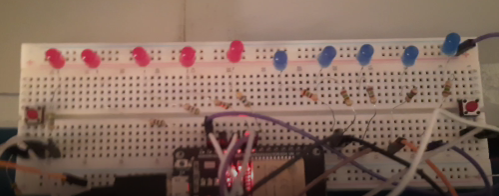
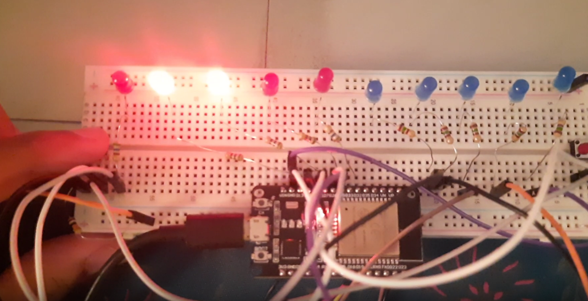

# LED Flicker with Button Control

[](https://platformio.org/) 
[](https://www.espressif.com/en/products/socs/esp32) 
[](https://www.arduino.cc/) 
[](https://www.freertos.org/)

## Overview
This project demonstrates an ESP32-based LED (Flicker in Fwd or Rev Sequence ) Control with FreeRTOS task management. It features a sequence of 10 LEDs that create a "chase" effect in either forward or reverse direction, controlled by two buttons( can be replace by any sensor as per the requirement). 

The system uses FreeRTOS tasks for efficient operation and button debouncing.

## Features
- Forward and reverse LED chasing effects
- Two button controls for direction selection
- FreeRTOS task management for efficient operation
- Smooth LED transitions with trailing effect
- Hardware debouncing for reliable button input

## Hardware Requirements
- ESP32 Development Board
- 10 LEDs (connected to pins 26, 13, 27, 33, 32, 22, 23, 18, 19, 25)
- 2 Push buttons (connected to pins 12, 14) [with pull-up resistors, 

- **Go to Important Notes section for details] - some issue with pin 12 while uploading code**

- Appropriate resistors for LEDs and buttons
- Breadboard and jumper wires

## Software Implementation
The project uses FreeRTOS to create two main tasks:
1. **LED Control Task** - Manages the LED sequence and timing
2. **Button Reading Task** - Handles button input with debouncing

Communication between tasks is achieved using FreeRTOS queue.

## Demo

### Video Demonstration


https://github.com/prashantbhandary/Led-Flicker-With-Button/DemoVideo.mp4

### Images




## Installation and Setup
1. Clone this repository
2. Open the project in PlatformIO
3. Connect your ESP32 according to the circuit diagram
4. Build and upload the code to your ESP32

```bash
# Using PlatformIO CLI
platformio run --target upload
```

## Usage Instructions
1. Power on your ESP32
2. Press Button 1 (connected to pin 12) to trigger the forward LED sequence
3. Press Button 2 (connected to pin 14) to trigger the reverse LED sequence

## How It Works
- The system initializes two tasks running on the same core
- The button task continuously monitors the state of both buttons
- When a button press is detected, a command is sent to the LED task via a queue
- The LED task executes the appropriate sequence based on the received command
- Each LED sequence creates a trail effect by turning on the current LED while turning off LEDs two positions behind

## Configuration
You can modify the following parameters in the code:
- can be add the gryo sensor insted of button to control fwd or rev sequence of the led.

- can use the ir sensor to make the touchless control of the led sequence.
- LED pins: Change the `LED_PINS` array
- Button pins: Change the `BUTTON_PINS` array

### Important Notes:

1. **Pin Configuration**: 
   - LEDs are connected to pins: 26, 13, 27, 33, 32, 22, 23, 18, 19, 25
   - Buttons are connected to pins: 12 and 14
   - You can modify these pin assignments in the code to match your own circuit configuration.

2. **Upload Issues with Pin 12**:
   - Pin 12 is configured with a pull-up resistor in this project
   - This may cause interference when uploading code to the ESP32
   - If you encounter upload issues, temporarily disconnect the wire from pin 12 during code upload, then reconnect it afterward


## Acknowledgments
- FreeRTOS documentation and community
- ESP32 Arduino core contributors
- PlatformIO development team